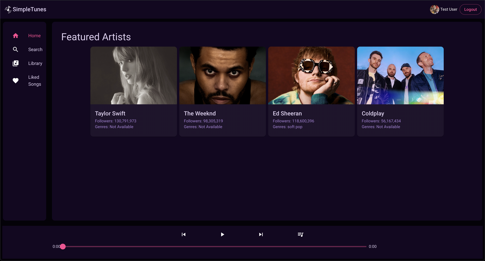
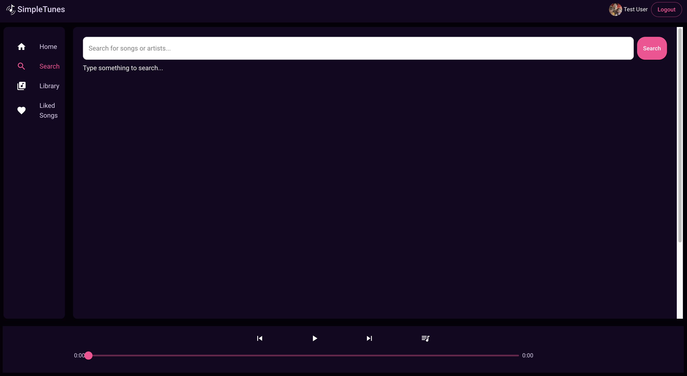
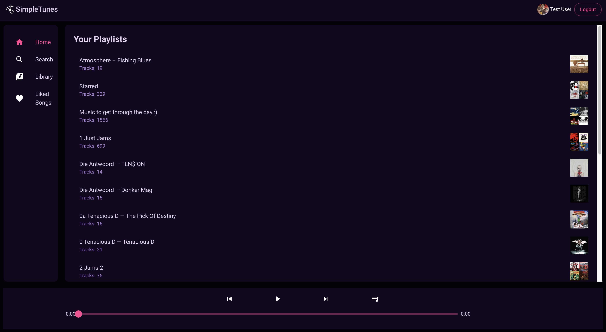

# Spotify Team Project: SimplePlayer

A collaborative Spotify application that allows users to browse, search, and manage playlists with an integrated web player.


## Features ✨

- <span class="highlight">User Authentication:</span> Authenticate users with Spotify using OAuth.
- <span class="highlight">Browse Music:</span> Navigate through Home, Search, Library, and Liked Songs tabs.

### **Browse Music**
- Navigate through intuitive sections like:
  - <span class="highlight">Home(WIP)</span>: Discover personalized recommendations and recent activity.
  - <span class="highlight">Search</span>: Find songs, albums, artists, and playlists instantly.
  - <span class="highlight">Library</span>: Access your saved playlists, albums, and artists.
  - <span class="highlight">Liked Songs(WIP)</span>: Quickly view and play songs marked as favorites.

### **Playlist Management**
- <span class="highlight">View Playlists</span>: Display detailed information, including tracks, cover art, and playlist descriptions.
- <span class="highlight">Add to Playlist</span>: Add songs from anywhere in the app to any playlist in your library.

### **Web Player Integration**
- Play, pause, and control music directly within the app using the Spotify Web Playback SDK.
- Display track details such as song title, artist, and album cover in real-time.
- Dynamic song progress bar and playback controls for a seamless listening experience.

### **Dynamic Routing**
- Smooth navigation across app sections using React Router.
- No page reloads, ensuring a fast and responsive user experience.

## Tech Stack 🛠️

### Frontend
- **[React](https://react.dev/)**: Component-based UI development.
- **[Material-UI](https://mui.com/material-ui/#/)**: Modern, customizable UI components.
- **[React Router](https://reactrouter.com/)**: Enables seamless navigation between pages without reloading the app.

### Backend
- **[Node.js](https://nodejs.org/en)**: JavaScript runtime for server-side logic.
- **[Express](https://expressjs.com/)**: Minimalist web framework for building APIs.

### API Integration
- **[Spotify Web API](https://developer.spotify.com/documentation/web-api)**: Fetch user data, playlists, and playback information.

### Environment Management
- **[Vite](https://vite.dev/)**: High-performance build tool and development server.

## Screenshots




## Installation Instructions

1.	Clone the repository:

```shell
git clone https://github.com/your-repo/SpotifyTeamProject.git
cd SpotifyTeamProject
```

2.	Install dependencies:

```shell
npm install
```
3.	Set up the environment variables:

- Create a .env file in the project root.
- Add the following snippet to .env:

```
VITE_SPOTIFY_CLIENT_ID=your-client-id
VITE_SPOTIFY_SCOPE=playlist-read-private playlist-modify-private playlist-modify-public streaming user-read-playback-state user-modify-playback-state user-read-currently-playing app-remote-control user-top-read user-read-recently-played user-library-modify user-library-read user-read-email user-read-private
VITE_SPOTIFY_REDIRECT_URI=http://localhost:5173/getToken
```
4.	Run the development server:
```shell
npm run dev
```
5.	Access the app in your browser:
```shell
Open http://localhost:5173.
```

## Project Structure

```bash
SpotifyTeamProject/
├── public/                # Static assets
├── src/
│   ├── components/        # Reusable components (e.g., Header, Sidebar, Player)
│   ├── pages/             # Route-specific components
│   ├── utils/             # Helper functions and constants
│   ├── App.jsx            # Main application file
│   ├── theme/             # MUI theme configuration
│   └── spotify/           # Spotify OAuth and API integration
├── .env                   # Environment variables
├── package.json           # Node.js dependencies and scripts
└── README.md              # Project documentation
```
## How it Works

1. Authentication: The app uses Spotify’s OAuth to grant access to user accounts and fetch data.
2.	Dynamic Routing: React Router is used to handle navigation between different sections like Home, Search, Library, and Liked Songs.
3.	Spotify API: All data (playlists, songs, playback) is fetched using the Spotify Web API.
4.	Material-UI: Provides a sleek and responsive UI design.

## Available Scripts

-	npm run dev - Start the development server.
-	npm run build - Build the project for production.
-	npm run preview - Preview the production build locally.

## Contributing

1.	Fork the repository.
2.	Create a feature branch:

```shell
git checkout -b feature/your-feature
```

3.	Commit your changes:
```shell
git commit -m "Add your changes here"
```

4. Push the branch:
```shell
git push origin feature/your-feature
```

5. Open a pull request.

## License 📜

This project is licensed under the MIT License. See the LICENSE file for details.

## Acknowledgements 🙏
Team Contributions: A big thanks to all team members for their dedication and effort in bringing this project to life.
- <span class="highlight">Spotify for Developers:</span> For providing a powerful API that made this project possible.
- <span class="highlight">Open-Source Community:</span> For invaluable resources, tools, and documentation that supported our development process.
- [Margit Tennosaar](https://github.com/margittennosaar/margittennosaar) & [Santosh Kalwar](https://github.com/kalwar): For guiding us throughout the project lifecycle and offering insightful feedback.

<style>
    .highlight{
        color: #FF4693;
        font-weight: bold;
    }
</style>

